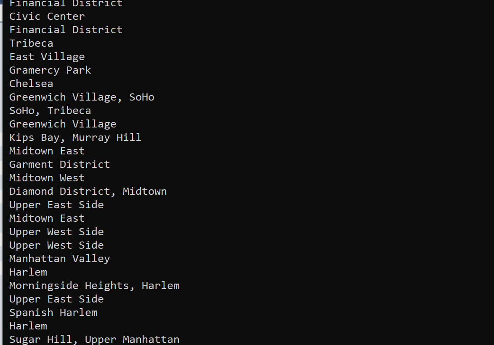
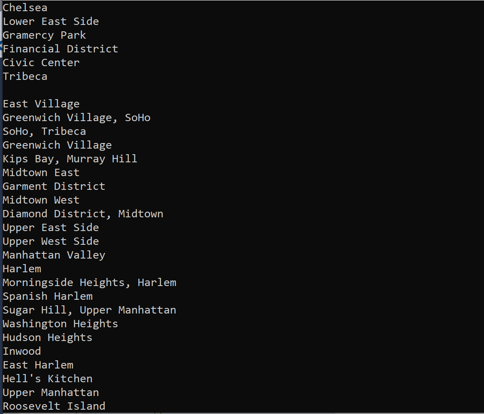

# lab08-LINQ

tell them what it is (with context, provide a summary)

This lab is using JSON file to filter out information.

Add the data.json file to your solution root folder

Manage packages NuGet packages and install NewtonSoftJson

using  string st = stream.ReadToEnd(); to read JSON file and get string and  using JObject o = JObject.Parse(st); to get the JObject

Under solution root i created a Classes folder holding four customized classes: Feature,Geometry,Properties and RootObject.

For Example, we can get result print out when we fill out those empty neighbothoods.

From the above image we can see we have duplicates ,we have two Upper West Side, now we use RomoveDuplicate(list) to filter out duplicates

